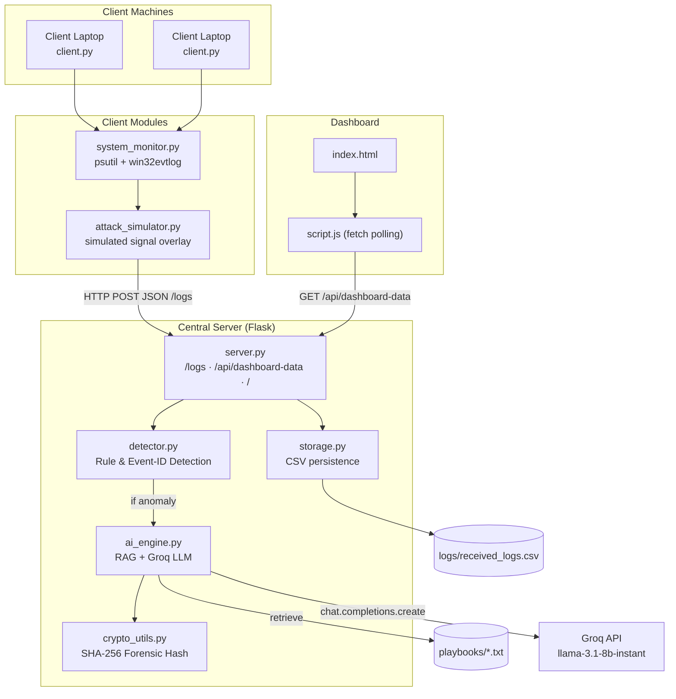
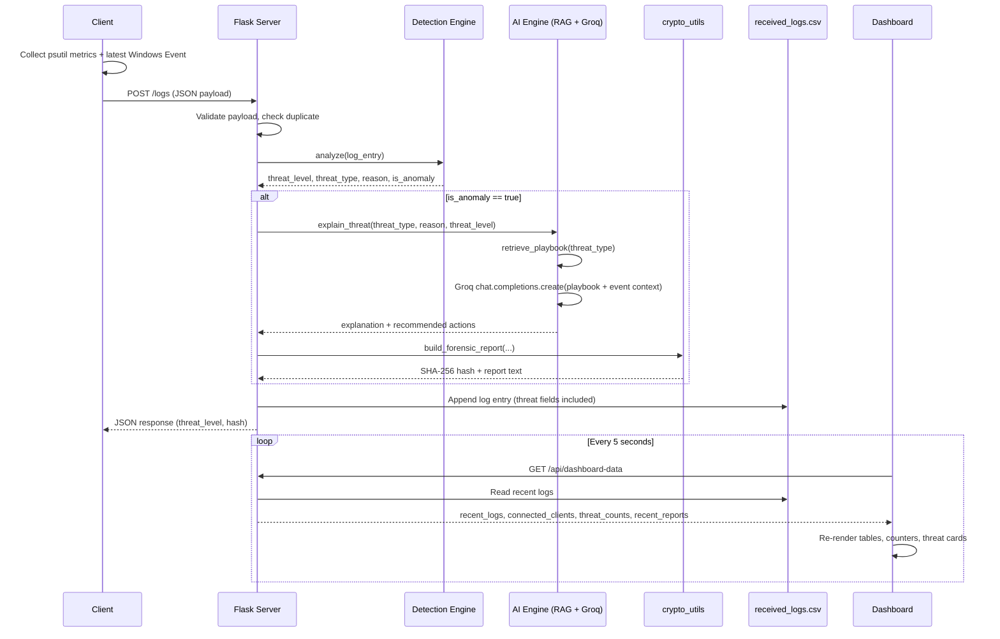
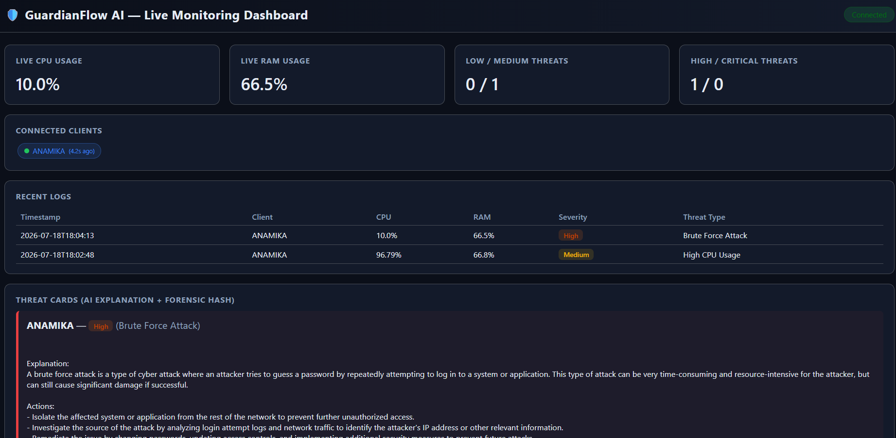

# 🛡️ GuardianFlow AI

**A lightweight, distributed endpoint monitoring platform that turns raw Windows telemetry into AI-explained, forensically-hashed security incidents.**

[](https://www.python.org/)
[](https://flask.palletsprojects.com/)
[-F55036)](https://groq.com/)
[](#)
[](#)

---

## Table of Contents

- [Executive Summary](#executive-summary)
- [Problem Statement](#problem-statement)
- [Features](#features)
- [High-Level Architecture](#high-level-architecture)
- [End-to-End Workflow](#end-to-end-workflow)
- [Folder Structure](#folder-structure)
- [Technology Stack](#technology-stack)
- [Installation](#installation)
- [Environment Variables](#environment-variables)
- [Running the Project](#running-the-project)
- [API Documentation](#api-documentation)
- [Detection Engine](#detection-engine)
- [AI Threat Analysis (RAG + Groq)](#ai-threat-analysis-rag--groq)
- [Dashboard](#dashboard)
- [Security Features](#security-features)
- [Screenshots](#screenshots)
- [Future Roadmap](#future-roadmap)
- [Contributors](#contributors)
- [License](#license)

---

## Executive Summary

GuardianFlow AI is a distributed endpoint monitoring system built around a simple loop: **client machines collect real Windows telemetry and event log data → a central Flask server evaluates it against a set of detection rules → any flagged event is explained by an LLM grounded in an incident-response playbook → the result is cryptographically hashed and streamed to a live dashboard.**

The system runs entirely on a local network using plain HTTP/JSON — no message brokers, no external databases, no containers. A central server (`server/server.py`) exposes a small Flask API that ingests telemetry from one or more client agents (`client/client.py`), evaluates each event, and serves a self-refreshing web dashboard (`dashboard/`) built with vanilla HTML/CSS/JS.

## Why GuardianFlow AI?

Traditional monitoring tools collect logs but often require analysts to manually interpret security events. GuardianFlow AI combines endpoint telemetry, Windows Event Log monitoring, AI-assisted threat explanation, contextual incident-response playbooks, and forensic hashing into a centralized Security Operations Center (SOC) dashboard.

The goal is to transform raw security events into understandable, actionable security insights for analysts and students learning SOC workflows.

## Problem Statement

Small teams and individual machines rarely have visibility into what is actually happening on their endpoints in real time. Commercial SIEM and EDR platforms are heavyweight, expensive, and require dedicated infrastructure (Elastic clusters, agents, licensing). GuardianFlow AI addresses the gap for small-scale or educational security monitoring by:

- Continuously collecting live system metrics (CPU/RAM/disk/process counts) and native **Windows Event Log** entries from each endpoint.
- Evaluating each event against a deterministic set of threat indicators (failed logins, disabled firewall, USB insertion, resource spikes, and specific Windows Event IDs such as log clearing or new-service installation).
- Translating a flagged event from a raw signal into a plain-English explanation with recommended mitigation steps, grounded in a specific incident-response playbook rather than generic LLM knowledge.
- Providing a single, centralized, auto-refreshing view of every connected machine's state — without requiring any external monitoring infrastructure.

## Features

| Feature | Description | Status |
|---|---|---|
| Real-time endpoint telemetry | Clients collect CPU, RAM, disk usage, process count, and logged-in user via `psutil` every 5 seconds | ✅ Implemented |
| Windows Event Log ingestion | Clients read the latest entry from the `System` and `Application` event logs via `pywin32` (`win32evtlog`) | ✅ Implemented |
| Distributed client/server architecture | Any number of clients can POST to one central Flask server over HTTP/JSON on a LAN | ✅ Implemented |
| Rule & Event-ID based threat detection | Deterministic checks for firewall state, failed logins, USB connection, CPU/RAM thresholds, and a curated map of Windows Event IDs | ✅ Implemented |
| Playbook-aware AI explanations (RAG) | Before calling the LLM, the matching `.txt` playbook is retrieved from `playbooks/` and injected into the prompt | ✅ Implemented |
| LLM-generated threat explanations | Groq's `llama-3.1-8b-instant` model (via the OpenAI-compatible SDK) produces a plain-English explanation and action list | ✅ Implemented |
| Forensic SHA-256 hashing | Every generated threat report is hashed with `hashlib.sha256`, displayed on its dashboard card | ✅ Implemented |
| Live auto-refreshing dashboard | Vanilla JS `fetch()` polls `/api/dashboard-data` every 5 seconds and re-renders the DOM | ✅ Implemented |
| Connected-client tracking | Server infers "online" clients from log recency (last seen ≤ 30s) | ✅ Implemented |
| CSV-based persistence | All logs are appended to `logs/received_logs.csv`; no external database | ✅ Implemented |
| Duplicate log rejection | In-memory `(client_name, timestamp)` set rejects repeat submissions (e.g. from client retries) | ✅ Implemented |
| Client-side retry logic | `client.py` retries a failed POST up to 3 times with a backoff delay before giving up on that cycle | ✅ Implemented |
| Attack simulation mode | Interactive terminal menu overlays simulated Brute Force, DDoS, Cryptomining, Firewall-Disabled, or USB-Connected signals onto the outgoing payload | ✅ Implemented |
| Unsupervised ML (Isolation Forest) | `scikit-learn` Isolation Forest logic exists in the codebase (`generate_data.py`, `IsolationForest` dependency) but the active `ThreatDetector.analyze()` no longer trains or scores against it | ⚠️ Present but inactive |
| Charts / graphs / filters | Not present in the current dashboard implementation | ❌ Not implemented |

## High-Level Architecture



## End-to-End Workflow



## Folder Structure

```
GuardianFlowAI/
├── server/
│   ├── server.py            # Flask app: /logs, /api/dashboard-data, /
│   ├── detector.py          # Rule & Windows Event-ID based threat detection
│   ├── ai_engine.py         # RAG pipeline + Groq LLM call (OpenAI SDK)
│   ├── storage.py           # CSV read/write, dedup, connected-client tracking
│   ├── crypto_utils.py      # SHA-256 forensic hashing
│   └── generate_data.py     # Legacy synthetic dataset generator (Isolation Forest, unused by detector.py)
├── client/
│   ├── client.py            # Main send loop, retry logic, CLI mode selector
│   ├── attack_simulator.py  # Simulated attack signal overlay
│   └── system_monitor.py    # psutil metrics + win32evtlog Event Log reader
├── dashboard/
│   ├── templates/
│   │   └── index.html       # Dashboard page (Jinja2)
│   └── static/
│       ├── style.css        # Dark SOC-style theme
│       └── script.js        # fetch()-based polling and DOM rendering
├── playbooks/
│   ├── cryptomining.txt
│   ├── bruteforce.txt
│   └── ddos.txt
├── logs/
│   ├── received_logs.csv    # Populated at runtime
│   └── training_data.csv    # Legacy — produced by generate_data.py, not consumed by the active detector
├── .env                     # GROQ_API_KEY (git-ignored)
├── .gitignore
├── requirements.txt
└── README.md
```

## Technology Stack

| Layer | Technology |
|---|---|
| Language | Python 3.11 |
| Web Framework | Flask 3.0 |
| Templating | Jinja2 (`render_template`, `url_for`) |
| HTTP Client (agent → server) | `requests` |
| System Telemetry | `psutil` |
| Windows Event Log Access | `pywin32` (`win32evtlog`) |
| Data Handling | `pandas`, `numpy` (used by the legacy `generate_data.py` path) |
| Legacy ML Dependency | `scikit-learn` (`IsolationForest`), `joblib` — present in `requirements.txt`, not invoked by the active detector |
| LLM Provider | Groq (`llama-3.1-8b-instant`) accessed via the **OpenAI-compatible Python SDK** (`openai.OpenAI`, custom `base_url`) |
| Environment Config | `python-dotenv` (`load_dotenv()`) |
| Frontend | Vanilla HTML, CSS, JavaScript (`fetch` API, no framework) |
| Data Persistence | CSV (`csv.DictWriter` / `csv.DictReader`) — no database |
| Forensic Integrity | Python `hashlib` (SHA-256) |
| Concurrency Safety | `threading.Lock` around CSV writes |

## Installation

**Prerequisites:** Python 3.11, Windows 11 (required for `pywin32` Event Log access on client machines), all machines on the same network for multi-client demos.

```powershell
# 1. Clone the repository
git clone <this-repo>
cd GuardianFlowAI

# 2. Create and activate a virtual environment
python -m venv .venv
.venv\Scripts\activate

# 3. Install dependencies
pip install -r requirements.txt

# 4. Client machines additionally need pywin32 for Event Log access
pip install pywin32
```

> `pywin32` is imported directly by `client/system_monitor.py` but is not currently listed in `requirements.txt` — install it explicitly on any machine running `client.py`.

## Environment Variables

| Variable | Required | Used By | Purpose |
|---|---|---|---|
| `GROQ_API_KEY` | Yes | `server/ai_engine.py` | Authenticates requests to the Groq API (`https://api.groq.com/openai/v1`) via the OpenAI-compatible client |

Create a `.env` file in the project root (this file is already listed in `.gitignore` and must never be committed):

```
GROQ_API_KEY=your_groq_api_key_here
```

`ai_engine.py` loads this automatically via `load_dotenv()` at import time.

## Running the Project

**1. Start the server** (on the machine that will act as the central hub):

```powershell
python server/server.py
```

This binds Flask to `0.0.0.0:5000`, making the dashboard reachable from other devices on the same network at `http://<server-ip>:5000`.

**2. Configure each client** — edit `client/client.py`:

```python
SERVER_IP = "127.0.0.1"        # change to the server machine's LAN IP
CLIENT_NAME = "Client-Laptop-1" # unique name per machine
```

**3. Run the client:**

```powershell
python client/client.py
```

You'll be prompted to choose:
- **[1] Normal auto-send** — sends real telemetry + the latest Windows Event every 5 seconds.
- **[2] Interactive attack menu** — lets you overlay a simulated Brute Force, DDoS, Cryptomining, Firewall-Disabled, or USB-Connected signal onto each outgoing payload.

**4. Open the dashboard** in a browser at `http://<server-ip>:5000` and watch it refresh automatically every 5 seconds.

## API Documentation

### `POST /logs`

Ingests a single telemetry payload from a client.

**Required fields:** `client_name`, `hostname`, `ip_address`, `timestamp`, `event_id`, `event_source`, `event_time` (payload is rejected with `400` if any are missing, or if `event_id` is not a positive integer).

**Example request:**
```json
{
  "client_name": "Client-Laptop-1",
  "hostname": "DESKTOP-UUNV2UO",
  "ip_address": "172.16.161.12",
  "logged_in_user": "ANAMIKA",
  "event_id": 4625,
  "event_source": "Microsoft-Windows-Security-Auditing",
  "event_type": 4,
  "event_time": "2026-07-16 01:35:55",
  "cpu_usage": 22.1,
  "ram_usage": 78.3,
  "disk_usage": 73.9,
  "process_count": 281,
  "failed_logins": 0,
  "firewall_disabled": 0,
  "network_bytes_sent": 110005180,
  "network_bytes_recv": 986742066,
  "usb_connected": 0,
  "timestamp": "2026-07-16T01:36:32"
}
```

**Example response:**
```json
{
  "status": "received",
  "threat_level": "High",
  "threat_type": "Brute Force Attack",
  "confidence_score": 95,
  "sha256_hash": "a3f9c1...e08b"
}
```

Other possible `status` values: `"ignored"` (duplicate `client_name` + `timestamp`), `"error"` (invalid/missing JSON or validation failure).

### `GET /api/dashboard-data`

Returns the aggregated state consumed by the dashboard's polling loop.

**Example response:**
```json
{
  "recent_logs": [ { "timestamp": "...", "client_name": "...", "cpu_usage": "...", "threat_level": "..." } ],
  "connected_clients": [ { "client_name": "Client-Laptop-1", "seconds_ago": 2.3 } ],
  "threat_counts": { "Low": 12, "Medium": 3, "High": 5, "Critical": 1 },
  "recent_reports": [ { "client_name": "...", "threat_type": "...", "explanation": "...", "sha256_hash": "..." } ],
  "server_time": "2026-07-18T10:15:02+05:30"
}
```

### `GET /`

Serves the dashboard's `index.html` (Jinja2-rendered).

### Error Handling

| Scenario | Server Behavior |
|---|---|
| Invalid / unparsable JSON | `400 { "status": "error", "message": "Invalid JSON payload." }` |
| Missing required field | `400 { "status": "error", "message": "Missing required field: <field>" }` |
| Invalid `event_id` (≤ 0) | `400 { "status": "error", "message": "Invalid Event ID." }` |
| Duplicate `(client_name, timestamp)` | `200 { "status": "ignored", ... }` |
| Detector not ready | `503 { "status": "error", "message": "Detector not ready: ..." }` |
| Unknown route | `404 { "status": "error", "message": "Endpoint not found." }` |
| Unhandled exception | `500 { "status": "error", "message": "Internal server error." }` |
| Client cannot reach server | `client.py` retries up to 3 times with a 1.5s backoff, then gives up until the next 5s cycle |
| No Event Log entry available | `system_monitor.py` returns `None`; `client.py` skips that cycle rather than sending an incomplete payload |

## Detection Engine

`server/detector.py`'s `ThreatDetector.analyze()` is a **deterministic, threshold- and Event-ID-based** detector — it evaluates each incoming payload against an ordered set of checks rather than scoring it with a trained model:

1. **Live system checks** (evaluated first, in order): firewall disabled → `High`; ≥5 failed logins → `High` (Brute Force); USB connected → `Medium`; CPU ≥ 90% → `Medium`; RAM ≥ 95% → `Medium`.
2. **Windows Event ID map** (checked if none of the above triggered): a fixed dictionary maps specific Event IDs to a threat type, severity, and reason — e.g. `4625` → Brute Force / High, `1102` → Log Tampering / Critical (Security log cleared), `7045` → Suspicious Service / Critical (new service installed), `4720` → New User Created / Critical, `41` → Kernel Power Failure / High, and several others (`4624`, `4726`, `7036`, `6008`, `105`).
3. Anything matching none of the above returns `Low` / `Unknown Event` with `is_anomaly: False`.

`load_model()`, `train_synthetic()`, and `train_live()` are retained as no-op methods (for interface compatibility with `server.py`'s `initialize_detector()`), but perform no training and load nothing.

**Legacy artifact:** `generate_data.py` still generates a synthetic dataset (500 normal + 50 attack rows) into `logs/training_data.csv`, and `requirements.txt` still lists `scikit-learn` and `joblib`. These correspond to an `IsolationForest`-based design that is **not currently wired into `ThreatDetector.analyze()`** — no model is trained, saved, or scored against in the active request path.

## AI Threat Analysis (RAG + Groq)

`server/ai_engine.py` implements a two-step Retrieval-Augmented Generation flow, triggered only when the detector flags `is_anomaly: True`:

1. **Retrieve** — `retrieve_playbook(threat_type)` loads the matching `.txt` file from `playbooks/` (`cryptomining.txt`, `bruteforce.txt`, or `ddos.txt`). Threat types with no matching file fall back to a generic incident-response message.
2. **Augment & Generate** — `_build_prompt()` embeds the threat type, severity, detection reason, and the full playbook text into a structured prompt instructing the model to respond with a two-sentence explanation and a bulleted action list. The request is sent via:

```python
client = OpenAI(
    api_key=os.getenv("GROQ_API_KEY"),
    base_url="https://api.groq.com/openai/v1"
)

client.chat.completions.create(
    model="llama-3.1-8b-instant",
    messages=[...],
    temperature=0.3
)
```

This is the **OpenAI Python SDK pointed at Groq's OpenAI-compatible endpoint** — there is no direct dependency on Google Gemini in the active code path.

If the API call fails (missing key, network error, rate limit), `explain_threat()` catches the exception and falls back to returning the first 400 characters of the raw playbook text, so the pipeline degrades gracefully instead of crashing the request.

`_extract_bullets()` parses lines starting with `-`, `*`, or `•` out of the model's response to populate the dashboard's recommended-actions list.

## Dashboard

`dashboard/templates/index.html` + `dashboard/static/script.js` render a single-page dark-themed dashboard, fully re-rendered every 5 seconds by `refreshDashboard()`:

| Component | Source of Data | Behavior |
|---|---|---|
| Live CPU / RAM cards | `cpu_usage` / `ram_usage` of the most recent log entry | Updated each poll |
| Threat counters (Low/Medium/High/Critical) | `threat_counts` from `storage.count_threats_by_level()` | Tallied from the full CSV on each request |
| Connected Clients | `connected_clients` — clients seen within the last 30 seconds | Rendered as pill badges |
| Recent Logs table | `recent_logs` — last 20 CSV rows, newest first | Columns: timestamp, client, CPU, RAM, severity badge, threat type |
| Threat Cards | `recent_reports` — last 10 AI-generated reports (in-memory, server-side) | Shows client, severity badge, threat type, LLM explanation, bulleted actions, and the SHA-256 hash |
| Connection status pill | Result of the `fetch()` call itself | Green "Connected" on success, red "Offline / Retrying..." on fetch failure |

There are no charts, graphs, or filter controls in the current implementation — all views are tables, counters, and cards.

## Security Features

| Feature | Implementation |
|---|---|
| Forensic report hashing | SHA-256 over a canonical `CLIENT \| THREAT \| SEVERITY \| EXPLANATION \| TIMESTAMP` string (`crypto_utils.build_forensic_report`), independently re-verifiable via `verify_report_hash()` |
| Payload validation | Required-field check + `event_id` positivity check before any processing occurs |
| Duplicate submission rejection | In-memory `(client_name, timestamp)` set, capped at 500 entries |
| Thread-safe log writes | `threading.Lock()` wraps every CSV append in `storage.save_log()` |
| Secret isolation | `GROQ_API_KEY` is loaded from `.env` via `python-dotenv`, and `.env` is listed in `.gitignore` |
| Graceful LLM failure handling | Exceptions from the Groq API call are caught and replaced with a playbook-derived fallback rather than surfacing an error to the client |
| Client-side network resilience | Up to 3 retries with a fixed backoff on connection errors or timeouts before a submission cycle is abandoned |

There is currently no authentication on `/logs` or `/api/dashboard-data`, and no transport encryption (plain HTTP) — the system is designed for a trusted local network.


## 📸 Screenshots

### Dashboard Overview



---

### Client Live windows eventt log Terminal


---

### Client Interactive mode terminal


---

### Server Terminal


---

## Future Roadmap

- **Re-activate the Isolation Forest path** — wire `generate_data.py` / `scikit-learn` back into `ThreatDetector` for unsupervised anomaly scoring alongside the existing rule/Event-ID checks.
- **Windows Event Log breadth** — read more than the single latest entry per poll (currently only the most recent `System`/`Application` record is captured).
- **Sysmon integration** — ingest Sysmon event channels for richer process/network telemetry than the base Windows Event Log provides.
- **SIEM / Elastic Stack export** — forward `received_logs.csv` rows to Elasticsearch or a similar store for long-term retention and search.
- **Authentication** — API keys or mutual TLS between clients and the server; the `/logs` endpoint currently accepts any request.
- **Role-based dashboard access** — separate read-only vs. analyst/admin views.
- **MITRE ATT&CK mapping** — tag each `threat_type` / Event ID with a corresponding ATT&CK technique ID in the playbook files.
- **Threat intelligence feed integration** — cross-reference `ip_address` values against known-bad IP lists.
- **Move off CSV** — migrate `storage.py` to SQLite for concurrent-write safety and queryability at scale.
- **WebSockets** — replace 5-second `fetch()` polling with push-based updates for lower latency.


## Contributors

Developed as part of a final-year vocational training project.

Team Members

- Anamika
- Kashifa Fatima
- Aryan Chandrakar
- Rajat Kumar Verma
