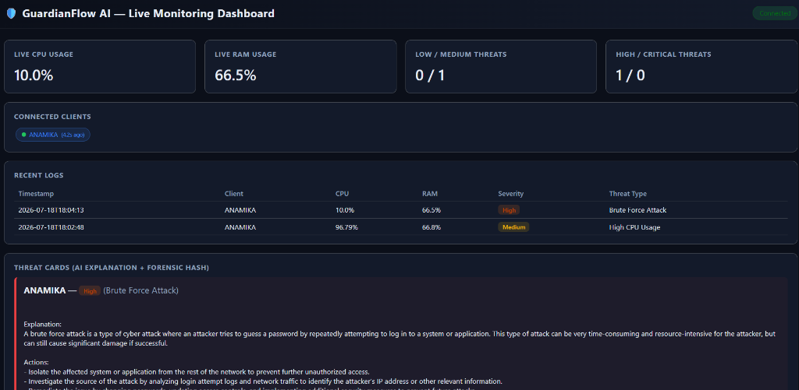
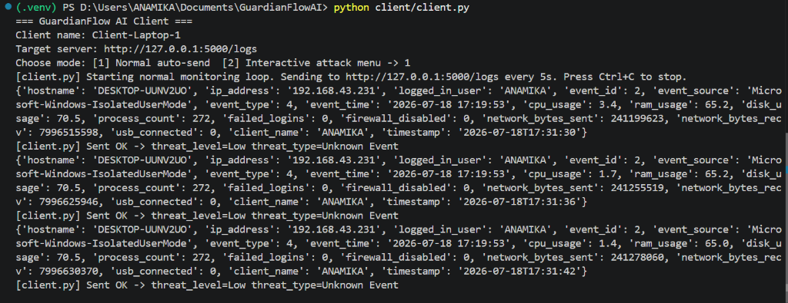
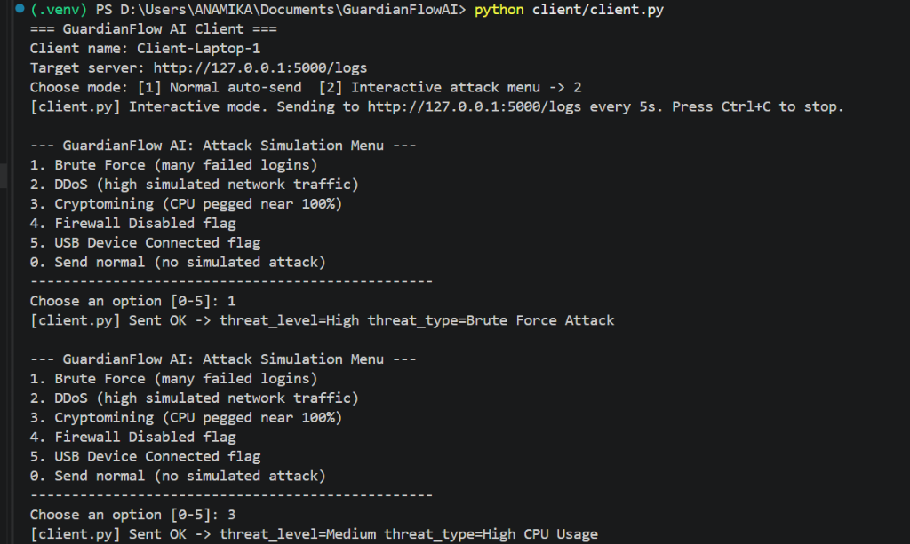
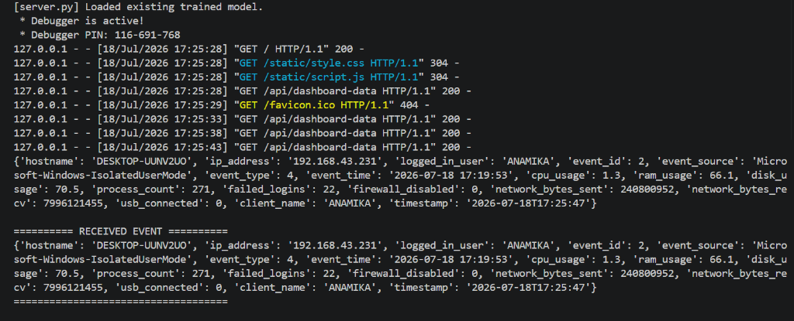
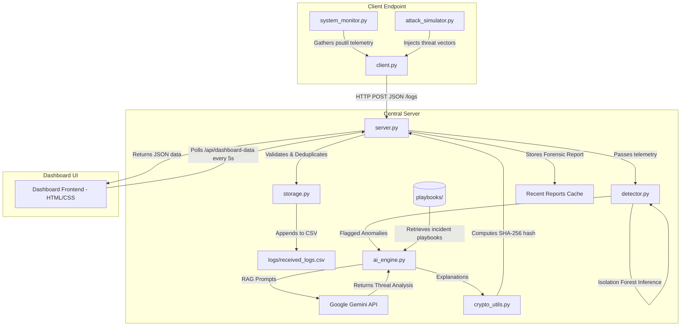

# GuardianFlowAI

[](https://www.python.org/)
[](#disclaimer)

A distributed cybersecurity endpoint telemetry monitoring and unsupervised anomaly detection system designed to identify and analyze security threats across local network hosts. 

---

## 1. Project Overview

**GuardianFlowAI** is a lightweight, proof-of-concept distributed cybersecurity monitoring system. It demonstrates how endpoint systems can stream multi-dimensional telemetry to a central monitoring server over a local network, allowing security analysts to detect anomalies without hardcoded signature rules. 

### The Security Problem
Modern security operations center (SOC) environments struggle with two primary challenges:
1. **Signature Evasion:** Traditional heuristic/rule-based detection tools fail to detect novel, zero-day, or multi-vector attacks where explicit signatures do not exist.
2. **Analysis Fatigue:** Complex system telemetry logs are hard to parse manually, and generic alert explanations increase response latency.

### How GuardianFlowAI Solves This
1. **Unsupervised Anomaly Detection:** The server evaluates system metrics (CPU, RAM, disk, network throughput, failed logins, etc.) using an unsupervised machine learning model to isolate anomalous spikes or behavioral deviations.
2. **RAG-Grounded AI Explanations:** When an anomaly is detected, the server automatically retrieves the appropriate local incident response playbook and passes it to the Google Gemini API to produce grounded, policy-compliant explanations and action steps.
3. **Forensic Integrity:** Every flagged threat report is cryptographically signed with a SHA-256 hash to prove non-repudiation and record state at the exact moment of detection.
4. **Operations Monitoring Dashboard:** A custom web dashboard aggregates system states, connection status, log tables, and generated threat reports in real time.

---

## 📊 Dashboard Preview
**GuardianFlowAI DASHBOARD**



**Client Live Windows Event Log Terminal**



**Client Interactive Mode Terminal**



**Server Terminal**


---

## 2. Key Features

Every feature described below is fully implemented and mapped to the repository source code:

*   **Multi-Host Telemetry Collection:** Clients run a background loop utilizing [`system_monitor.py`](client/system_monitor.py) to harvest system state indicators (`psutil` CPU/RAM/disk usage, processes, active sessions, failed logins, network throughput, and USB state) and send them as JSON payloads to the central server.
*   **Unsupervised Machine Learning Detection:** In [`detector.py`](server/detector.py), an `IsolationForest` model evaluates incoming telemetry against a baseline to assign continuous anomaly scores and classify threats as Low, Medium, High, or Critical.
*   **Dual-Mode Model Training:** The anomaly detector can be trained instantly using a synthetic dataset via [`generate_data.py`](server/generate_data.py) or by sampling the server host's own hardware metrics for a baseline duration (e.g., 10 minutes) using standard `psutil` queries.
*   **Retrieval-Augmented Generation (RAG):** When an anomaly occurs, [`ai_engine.py`](server/ai_engine.py) retrieves plain-text organizational playbooks from the [`playbooks/`](playbooks) folder matching the threat type, augmenting the prompt sent to the Google Gemini API (`gemini-1.5-flash`) for localized, grounded remediation instructions.
*   **Forensic Report Hash Stamping:** [`crypto_utils.py`](server/crypto_utils.py) compiles a canonical string of the incident details (client, threat type, severity, explanation, and timestamp) and generates a SHA-256 cryptographic signature to verify data integrity and prevent tampering.
*   **Interactive Attack Simulation:** [`attack_simulator.py`](client/attack_simulator.py) provides an interactive command-line interface on client nodes to simulate threat profiles (CPU-mining, DDoS network spikes, brute force login failures) by injecting anomalous parameters into outgoing payloads.
*   **Live Web Dashboard:** Served by Flask in [`server.py`](server/server.py), the dashboard UI loads [`index.html`](dashboard/templates/index.html) and uses [`script.js`](dashboard/static/script.js) to poll the server API every 5 seconds, displaying real-time metrics, client status, and threat cards.

---

## 3. Architecture

GuardianFlowAI operates as a decentralized telemetry pipeline. Monitored endpoints stream structured logs to a central server that runs detection, triggers RAG workflows, hashes forensic records, and feeds the web console.


```mermaid
flowchart TD
    subgraph Client Endpoint
        A[system_monitor.py] -->|Gathers psutil telemetry| B[client.py]
        C[attack_simulator.py] -->|Injects threat vectors| B
    end

    subgraph Central Server
        B -->|HTTP POST JSON /logs| D[server.py]
        D -->|Validates & Deduplicates| E[storage.py]
        E -->|Appends to CSV| F[logs/received_logs.csv]
        
        D -->|Passes telemetry| G[detector.py]
        G -->|Isolation Forest Inference| G
        
        G -->|Flagged Anomalies| H[ai_engine.py]
        I[(playbooks/)] -->|Retrieves incident playbooks| H
        H -->|RAG Prompts| J[Google Gemini API]
        J -->|Returns Threat Analysis| H
        
        H -->|Explanations| K[crypto_utils.py]
        K -->|Computes SHA-256 hash| D
        
        D -->|Stores Forensic Report| L[Recent Reports Cache]
    end

    subgraph Dashboard UI
        M[Dashboard Frontend - HTML/CSS] -->|Polls /api/dashboard-data every 5s| D
        D -->|Returns JSON data| M
    end
```

### Component Breakdown
*   **Endpoint Agent (Client):** Periodically takes snapshots of system performance and active security variables, formatting and transmitting them over HTTP.
*   **Flask Web Server:** Serves as the central API ingestion endpoint (`/logs`) and coordinates routing to the storage layer, detection module, and RAG pipelines.
*   **Threat Detector:** Evaluates multivariant feature vectors, determines if the telemetry constitutes an anomaly, maps the reason to a category, and outputs a severity label.
*   **AI Engine:** Retrieves static playbooks, formats structured Gemini API queries, parses the responses, and extracts remediation bullet points.
*   **Crypto Utils:** Secures the forensic audit trail by hashing the resulting output string, ensuring logs cannot be altered post-detection.
*   **Storage Manager:** Manages file-system logging to a flat-file database, handles query APIs, and verifies incoming client telemetry dates to ignore network duplicates.

---

## 4. Technology Stack

*   **Core Backend Framework:** Python 3.11+ / Flask 3.0.3 (Server)
*   **Client Communication & Network Request Client:** Requests 2.32.3
*   **Endpoint Telemetry Harvesting:** Psutil 6.0.0
*   **Data Analysis & Machine Learning Library:** Scikit-Learn 1.5.1 / Pandas 2.2.2 / Joblib 1.4.2
*   **Generative AI Integration:** Google Generative AI Python SDK (Gemini API)
*   **Environment Configuration:** Python-dotenv 1.0.1
*   **Frontend UI & Visual Styles:** Vanilla HTML5, Custom CSS3 Grid/Flexbox Layout, Vanilla ECMAScript (JS)

---

## 5. Project Structure

```
GuardianFlowAI/
├── assets/
│   ├── dashboard.png          # Dashboard screenshot
│   ├── server_console.png     # Server console logs screenshot
│   ├── client_autosend.png    # Client auto-send console screenshot
│   └── client_interactive.png # Client interactive simulator screenshot
├── server/
│   ├── server.py              # Flask app, HTTP ingestion routes, and API controllers
│   ├── detector.py            # Isolation Forest anomaly detection engine & metric classifier
│   ├── ai_engine.py           # RAG logic, local playbook parsing, and Gemini API caller
│   ├── storage.py             # CSV flat-file log manager, query API, and thread locks
│   ├── crypto_utils.py        # SHA-256 cryptographic forensic hashing utility
│   └── generate_data.py       # Training dataset generator (creates logs/training_data.csv)
├── client/
│   ├── client.py              # Endpoint execution agent & periodic HTTP transmission loops
│   ├── attack_simulator.py    # Console menu to simulate DDoS, mining, or login failure rates
│   └── system_monitor.py      # Local psutil telemetry snapshot engine & IP resolution
├── dashboard/
│   ├── templates/
│   │   └── index.html         # Custom dark-themed monitoring console structure
│   └── static/
│       ├── style.css          # Vanilla CSS layout, metric cards, and badge design
│       └── script.js          # Polling fetch controller to update dashboard DOM elements
├── playbooks/
│   ├── cryptomining.txt       # Incident response steps for cryptomining events
│   ├── bruteforce.txt         # Incident response steps for brute force events
│   └── ddos.txt               # Incident response steps for distributed denial of service
├── logs/
│   ├── received_logs.csv      # Log storage file created automatically at runtime
│   └── training_data.csv      # Training data generated by generate_data.py
├── requirements.txt           # Explicit python dependency constraints
├── .env                       # Environment variables config file
└── README.md                  # This file
```

---

## 6. How It Works

```
[System Data Gathered] ➔ [Deduplication & Validation] ➔ [Isolation Forest Isolation] ➔ [Playbook RAG Retrieval] ➔ [SHA-256 Audit Seal] ➔ [UI Dashboard Paint]
```

1.  **Metric Acquisition:** The [`client.py`](client/client.py) agent gathers local system telemetry and sends it to the server.
2.  **Validation & Verification:** The server validation layer verifies data bounds and rejects duplicates.
3.  **Machine Learning Inference:** The metrics are compared against the Isolation Forest baseline. Anomalous activity triggers threat mapping.
4.  **Retrieval-Augmented Prompting:** The server matches the threat category (e.g., `bruteforce`) to a text file in [`playbooks/`](playbooks). It formats a prompt with this context and requests an explanation from Google Gemini.
5.  **Forensic Seal:** The server formats a canonical report string and generates a SHA-256 digest, recording the hash next to the threat entry in memory and in `received_logs.csv`.
6.  **Real-Time Dashboard Rendering:** The client-side JS requests the server data API, updating metric panels, connection indicators, active nodes, and rendering threat cards with forensic codes.

---

## 7. Installation & Setup

### Prerequisites
*   Windows 10/11 (Local PowerShell environments recommended)
*   Python 3.11 or 3.12 installed on all participating machines
*   A Google Gemini API key (for RAG-grounded AI explanations)
*   All client machines must be connected to the same local area network (LAN) as the server.

### Repository Setup
Clone or copy the project directory to all machines, and set up the virtual environments:

```powershell
# Navigate to the cloned repository
cd GuardianFlowAI

# Initialize and activate Python virtual environment
python -m venv .venv
.venv\Scripts\Activate.ps1

# Install requirements
pip install -r requirements.txt
```

### Config Environment
On the **Server Machine**, configure the API keys. You can set it in your current terminal session:

```powershell
$env:GEMINI_API_KEY="your_gemini_api_key_here"
```

Alternatively, configure the API key in a local `.env` file:
GEMINI_API_KEY=your_gemini_api_key_here
```

---

## 8. Usage Instructions

Follow this exact startup sequence:

### Step 1: Pre-generate Anomaly Training Baseline
Before the server can start, the Isolation Forest model needs a training dataset. Run this once on the server machine to generate synthetic logs:

```powershell
python server/generate_data.py
```

### Step 2: Acquire Server LAN IP
Find the server's network address in the local subnet:

```powershell
ipconfig
```
Locate the active IPv4 address under your wireless or ethernet adapter (e.g., `192.168.1.10`).

### Step 3: Run the Server
Launch the Flask server app:

```powershell
python server/server.py
```
*   The server will initialize the anomaly model and start listening on port `5000`.
*   Access the live dashboard in a local web browser at `http://localhost:5000` or `http://<server-ip>:5000`.


*Server terminal output displaying active log reception, telemetry parsing, and raw event ingestion.*

### Step 4: Configure & Run Client Endpoint Nodes
1.  Open [`client/client.py`](client/client.py) and update the connection settings:
    ```python
    SERVER_IP = "192.168.1.10"   # Substitute with your actual Server IP
    CLIENT_NAME = "Client-Laptop-1" # Assign a unique identifier
    ```
2.  Start the client:
    ```powershell
    python client/client.py
    ```
3.  Choose execution behavior:
    *   Input `1` for **Normal Auto-Send:** Collects and streams real system telemetry every 5 seconds.
    *   Input `2` for **Interactive Attack Menu:** Manually prompt simulated threats.


*Client terminal executing in Auto-Send mode, gathering and forwarding telemetry payloads to the server.*

### Step 5: Simulate Incidents
With the client in Interactive Mode (`2`), select a threat type from the CLI prompt:
*   `1` - Brute Force (High failed logins)
*   `2` - DDoS (Network spike)
*   `3` - Cryptomining (Sustained CPU peg)
*   `4` - Firewall Disabled flag
*   `5` - USB Device Connected flag

Observe the server dashboard: an anomalous log row will be highlighted, and a new threat card will appear showing RAG playbook summaries, action steps, and the forensic SHA-256 signature.


*Client interactive terminal displaying the Attack Simulation menu and simulating high failed login and CPU spikes.*

---

## 9. Configuration Options

| Variable | Location | Type | Default Value | Description |
| :--- | :--- | :--- | :--- | :--- |
| `GEMINI_API_KEY` | Environment / `.env` | String | *Required* | Google Gemini model API key (loads `gemini-1.5-flash`). |
| `SERVER_IP` | [`client/client.py`](client/client.py) | String | `"192.168.1.10"` | Target host IP address of the Flask log ingestion server. |
| `CLIENT_NAME` | [`client/client.py`](client/client.py) | String | `"Client-Laptop-1"` | Endpoint identifier displayed on logs and dashboard panels. |
| `SEND_INTERVAL_SECONDS` | [`client/client.py`](client/client.py) | Integer | `5` | Metric reporting frequency (seconds) to the `/logs` route. |
| `contamination` | [`server/detector.py`](server/detector.py) | Float | `0.1` (synthetic) / `0.05` (live) | The expected ratio of outlier/anomaly values in baseline training. |

---

## 10. Security Considerations

*   **Authorized Testing Only:** The attack simulator (`attack_simulator.py`) only overrides JSON attributes to demonstrate telemetry reporting and ML evaluation. It does not perform actual network disruption or disable host system firewalls. However, because this platform ingests local system statistics, run client agents only on machines under your administrative control.
*   **PlainText Network Transmission:** Endpoint logs are currently sent over HTTP. This telemetry contains local IP addresses, usernames, hostnames, and process loads. In insecure network configurations, these packets could be exposed to eavesdropping.
*   **External LLM Ingestion:** System event logs flagged as anomalies are forwarded to Google Gemini API servers. Ensure that client names or logged-in usernames do not contain sensitive, regulated, or personally identifiable information (PII) before transmission.

---

## 11. Current Limitations

*   **File-Based Logging:** Data persistence uses a simple CSV file (`received_logs.csv`) protected by basic thread locks. High-frequency uploads from many clients could lead to file locking and performance degradation.
*   **Plaintext HTTP Communications:** The client-server framework lacks TLS/HTTPS, making transmission vulnerable to sniffing and spoofing.
*   **No Endpoint Authentication:** The `/logs` endpoint accepts payloads from any client that can reach the server on port `5000` without requiring certificates, API keys, or verification.
*   **Polling-Based Dashboard UI:** The dashboard refreshes metrics via standard HTTP GET polling every 5 seconds. It does not use live connection streams (e.g., WebSockets).
*   **LLM Fallbacks:** If API limits are reached, the system falls back to displaying truncated portions of local playbook files.

---

## 12. Future Enhancements

*   **Persistent Database Backend:** Migrate from flat CSV structures to relational databases (e.g., SQLite or PostgreSQL) to allow complex queries and historical analytics.
*   **Agent Identity Controls:** Introduce authentication protocols (such as mutual TLS or API token authorization headers) to verify endpoint clients.
*   **WebSockets Integration:** Implement real-time server-push notifications for instantaneous event display on the dashboard UI.
*   **Mitigation Actions Support:** Develop a response framework to run remediation scripts on client machines (e.g., automated host firewall rules or terminating anomalous processes).
*   **Expanded Telemetry Vectors:** Integrate file system watchers and Windows Event Log listeners to feed the ML model richer event data.

---

## 13. Development & Engineering Practices

*   **Separation of Concerns:** Client telemetry generation, server processing, ML classification, AI explanation, and UI presentation are partitioned into distinct, decoupled packages.
*   **Resiliency & Graceful Failures:**
    *   Client engines attempt up to 3 transmission retries with incremental sleep backoffs before storing logs locally or discarding them.
    *   The RAG engine handles network disconnects and API failures, yielding playbook fallbacks without crashing the core web server.
*   **Forensic Verification:** SHA-256 hashing is implemented as a mathematical function that acts as a structural validation layer for log authenticity.

---

## 14. Disclaimer

> [!IMPORTANT]
> **Disclaimer:** GuardianFlowAI is a proof-of-concept/demonstration project developed to showcase practical skills in cybersecurity system monitoring, unsupervised anomaly detection, and RAG-based security orchestration. It is intended for authorized testing and educational purposes only and should not be deployed in production network environments without comprehensive security audits, encryption upgrades, and authentication configuration.

---

## 15. Contributing

Since this is a personal portfolio repository, active contributions are closed. However, if you are analyzing this project for evaluation:
1.  **Fork** the repository to experiment with custom models or additional playbooks.
2.  Review [`docs/architecture.md`](docs/architecture.md) for details on the long-term refactoring vision.

---

